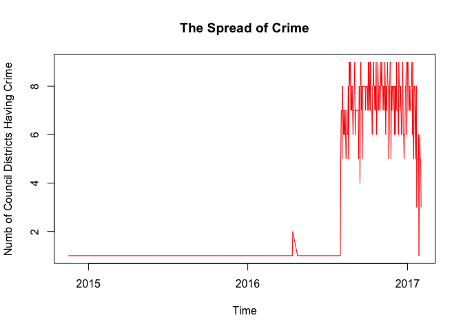

Alternative HW using dplyr package
================
Lilik Pranowo
March 22, 2017

Data manipulation
-----------------

Load "dplyr" and "tidyr" packages

``` r
library(dplyr) 
```

    ## 
    ## Attaching package: 'dplyr'

    ## The following objects are masked from 'package:stats':
    ## 
    ##     filter, lag

    ## The following objects are masked from 'package:base':
    ## 
    ##     intersect, setdiff, setequal, union

``` r
library(tidyr)
```

Read data:

``` r
dat <- read.csv("ArrestMini.csv")
dat<-na.omit(dat)
```

Create new variables: "DATE" and "TIME" from variables "ARRESTTIME" then save it to "dat1" dataframe

``` r
dat1 <- dat %>% 
  separate(ARRESTTIME, c('DATE', 'TIME'), sep = 'T')
```

    ##         DATE     TIME COUNCIL_DISTRICT
    ## 1 2016-09-12 22:53:00                1
    ## 2 2016-12-26 20:36:00                7
    ## 3 2016-12-27 15:19:00                4
    ## 4 2017-01-04 20:09:00                1
    ## 5 2017-01-07 22:28:00                6
    ## 6 2016-09-18 13:55:00                6

Aggregate council districts that is affected by crime on the day --&gt; I save it as "Arrest\_Daily"

``` r
Arrest_Daily <- dat1 %>%
  group_by(DATE) %>%
  summarize(CASES = n(), NUM_COUNCIL = n_distinct(COUNCIL_DISTRICT)) %>%
  arrange(DATE) 
```

    ## # A tibble: 212 × 3
    ##          DATE CASES NUM_COUNCIL
    ##         <chr> <int>       <int>
    ## 1  2014-11-16     3           1
    ## 2  2015-05-29     1           1
    ## 3  2015-11-04     2           1
    ## 4  2016-02-12     1           1
    ## 5  2016-02-17     1           1
    ## 6  2016-03-03     1           1
    ## 7  2016-04-04     1           1
    ## 8  2016-04-08     1           1
    ## 9  2016-04-10     1           1
    ## 10 2016-04-12     2           1
    ## # ... with 202 more rows

Plots
-----

Plot the number of council districts that reports at least one arrest for each day:

``` r
rdate <- as.Date(Arrest_Daily$DATE, "%Y-%m-%d")
```

``` r
plot(Arrest_Daily$NUM_COUNCIL~rdate, type="l", col="red", xlab="Time",ylab="Numb of Council Districts Having Crime", main="The Spread of Crime", lwd=1)
```


